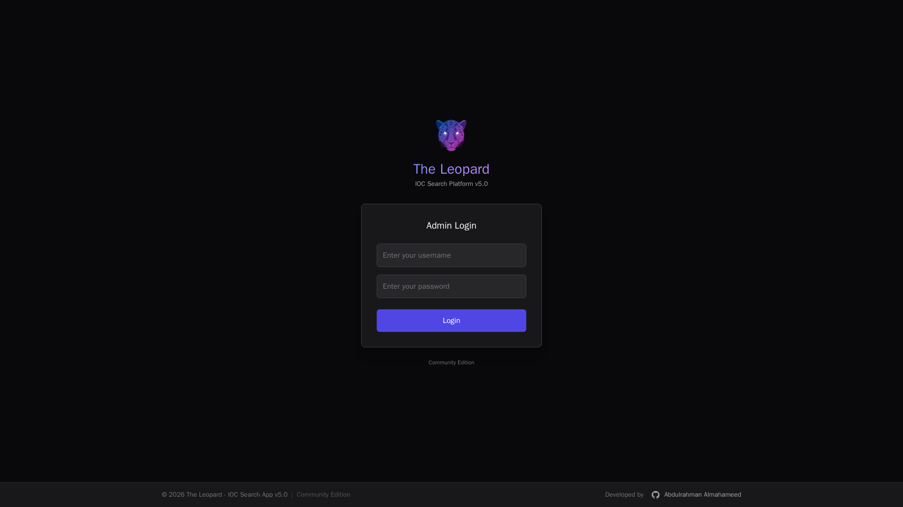
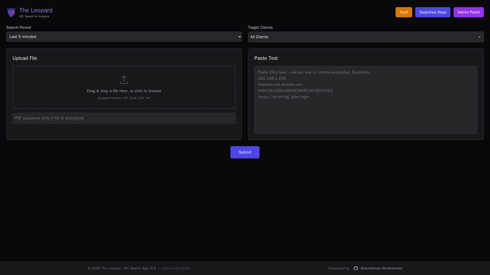
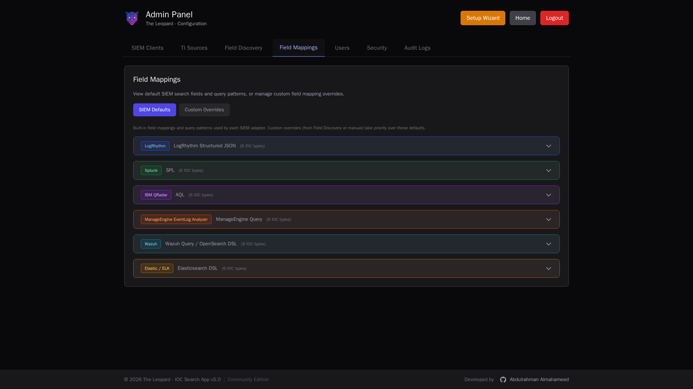
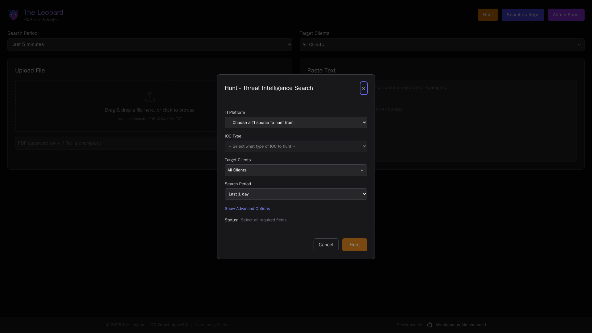

<div align="center">

# The Leopard

**A multi-SIEM indicator-of-compromise search and threat-hunting platform.**

_Point it at your SIEMs. Drop in IOCs. Get results — or the silence that means you're clean._

[](#changelog)
[](LICENSE)
[](docker-compose.yml)
[](docs/OFFLINE_INSTALL.md)

</div>

---

## What it is

The Leopard is a self-hosted console that unifies IOC search across the major SIEM platforms. You drop in a file of indicators (or paste them), pick one or more clients, and it fans the query out to each SIEM in parallel, collects the hits, and files the results in a searchable repository. It also pulls live indicators from 18 threat-intelligence feeds for one-click hunts and includes a field-discovery workflow for deployments where the stock field mappings don't match your schema.

It's built for SOC analysts and threat hunters who don't want a separate pane for every SIEM. Written in Node + React, shipped as three Docker containers. The source tree and all runtime components are MIT-licensed and fully operator-controlled.

## Supported SIEMs

| SIEM | Status | Per-SIEM scope |
| ---- | ------ | -------------- |
| **LogRhythm** | Tested | Individual log sources (queryLogSources), root-entity grouping |
| **Splunk** | Tested | Indexes |
| **IBM QRadar** | Tested | Log source IDs (`logsourceid IN (...)`) |
| **Elastic / ELK** | Experimental | Index patterns |
| **Wazuh** | Experimental | Agents (indexer DSL + manager alerts API) |
| **ManageEngine EventLog Analyzer** | Experimental | `log_source_ids` |

Each adapter accepts the same `logSources: [...]` option, stored per-(client, IOC type) in the admin panel. Empty mapping falls back to "scan everything" on every adapter.

## Supported IOC types

IP · Hash (MD5/SHA1/SHA256) · Domain · URL · Email · FileName. The parser accepts IOCs inline, comma-separated, from PDF/XLSX/CSV/TXT uploads, and in deobfuscated forms (`hxxps://`, `evil[.]com`, etc.).

## Threat Intelligence feeds

| Category | Platforms |
| -------- | --------- |
| API Platforms | AlienVault OTX, MISP, PhishTank |
| abuse.ch | ThreatFox, URLhaus, MalwareBazaar, Feodo Tracker, SSL Blacklist |
| IP Blocklists | Blocklist.de, Emerging Threats, Spamhaus DROP, FireHOL L1, Cisco Talos, CrowdSec |
| C2 & Malware | C2 Intel Feeds, Bambenek C2, DigitalSide |
| Phishing | OpenPhish |

---

## Screenshots

<p align="center">
  
  
</p>
<p align="center">
  
  
</p>

Full set of screenshots is under [`screenshots/`](screenshots/).

---

## Internet, proxies, and the three install paths

This is the single most-asked question when deploying into an enterprise environment, so it's up front.

### When does The Leopard need the internet?

- **At install time**, the Docker build needs to reach three things:
  1. **Docker Hub** — to pull `mysql:8.0`, `node:20-slim`, `nginx:alpine`
  2. **npm registry** — `npm ci` inside the backend and frontend build stages
  3. **Debian + Alpine package mirrors** — `apt-get install netcat-openbsd` (backend) and `apk add openssl` (frontend)
- **At runtime**, once the stack is running, the only external host the backend needs to reach is **your SIEM's API**. If the SIEM sits on the same management VLAN as The Leopard, no internet is required at all. Threat-intel feeds that pull from public sources (OTX, abuse.ch, etc.) are optional — turn them off under Admin → TI Sources if you're fully air-gapped.

### Three install paths, one command each

Pick the one that matches your network. All three land at `https://<host>:3000`.

#### 1. Direct internet

The host can reach Docker Hub, npm, and the OS package mirrors directly.

```bash
make install
```

Equivalent to `scripts/install.sh --direct`, which wraps `docker compose up -d --build` with a health wait and a clear final status line. Takes a few minutes on first build, seconds afterward.

#### 2. Through an HTTP proxy (install-time only)

The host can only reach the internet via a corporate HTTP proxy.

```bash
make install-proxy PROXY=http://10.5.13.13:8080
# with extra bypass list if needed:
make install-proxy PROXY=http://10.5.13.13:8080 NO_PROXY=10.0.0.0/8,.corp.local
```

The proxy is used **only** during install — for image pulls and build-time package installs. After the stack is up, the proxy is actively torn out of three independent places so it cannot intercept SIEM requests or container healthchecks at runtime:

1. A **transient systemd drop-in** is written to `/etc/systemd/system/docker.service.d/leopard-install-proxy.conf` so the Docker daemon can pull base images. It's removed and the daemon restarted after the build.
2. Proxy is passed to `docker compose build` as explicit `--build-arg` flags so `npm ci` / `apt-get` / `apk add` reach their registries. These build args stay in the build stage only — they don't end up in the final image's runtime env.
3. Any persistent `proxies` block in `~/.docker/config.json` is **backed up and removed** — that block is what causes Docker to auto-inject proxy env vars into every running container, which previously made the backend's SIEM requests come back `501 Not Implemented` and the frontend's busybox-wget healthcheck hit `503`.

As belt-and-suspenders, the `backend-v5` and `frontend-v5` services in `docker-compose.yml` explicitly set `HTTP_PROXY` / `HTTPS_PROXY` / `http_proxy` / `https_proxy` to the empty string and declare a sane `NO_PROXY`. Even a future change leaking proxy into container runtime would be overridden here.

Post-install verification (documented in [`docs/OFFLINE_INSTALL.md`](docs/OFFLINE_INSTALL.md)):

```bash
systemctl show --property=Environment docker        # must not contain the proxy
cat ~/.docker/config.json                           # must have no "proxies" key
docker exec ioc-backend-v5 env | grep -i proxy      # must show empty HTTP_PROXY/http_proxy
```

#### 3. Fully air-gapped

No internet on the target host at any point. Build a portable bundle once on any machine with Docker Hub access, ship the tarball to the target, and run the installer there.

```bash
# On an online staging box:
make bundle
#  -> dist/leopard-v<sha>-<YYYYMMDD>.tar.gz (+ .sha256 sidecar)

# Copy over (scp, USB, data diode), then on the offline target:
tar -xzf leopard-v<sha>-<YYYYMMDD>.tar.gz
cd leopard-v<sha>-<YYYYMMDD>
./install.sh
```

The bundle carries `docker save`'d copies of `mysql:8.0`, the backend, and the frontend, plus the compose file, `.env.example`, the full `docs/` folder, and a bundle-internal installer. No outbound network access from the target is required at any point during install.

Full reference, upgrade procedure, and diode-transport notes in [`docs/OFFLINE_INSTALL.md`](docs/OFFLINE_INSTALL.md).

---

## First-run setup

On first boot, `https://<host>:3000` redirects to a six-step wizard:

1. **Welcome** — pick deployment mode (Single SIEM or MSSP/multiple clients).
2. **Database** — test the MySQL connection. Default config works out of the box.
3. **SIEM Setup** — add your first SIEM client: type, API host, credentials, SSL verification toggle (leave off for self-signed).
4. **Log Sources** — pick which indexes / log sources / agents should be queried for each IOC type. Optional; can skip with a warning that searches will scan every source (slow).
5. **Admin User** — create the first admin account with MFA support.
6. **Complete** — choose whether login is required to run searches, and go.

After setup, the wizard is idempotent — it can be re-opened from Admin → Setup Wizard, and existing configuration is preserved.

---

## Architecture

Three Docker services, one internal network, one shared volume for MySQL.

```
 ┌────────────────────┐      ┌───────────────────┐      ┌──────────────┐
 │  frontend-v5       │──────│  backend-v5       │──────│  mysql-v5    │
 │  nginx + CRA build │      │  Node + Express   │      │  mysql:8.0   │
 │  :3000 (HTTPS)     │      │  :4000 (internal) │      │  :3316→3306  │
 │  :3080 (HTTP/health)│     │                   │      │  (localhost) │
 └────────────────────┘      └─────────┬─────────┘      └──────────────┘
                                       │
                             outbound HTTPS (only to
                             your configured SIEMs
                             + optional TI feeds)
```

- **Frontend**: React UI (Tailwind, IBM Plex + Fraunces typography, editorial dark + light themes), served by nginx with a self-signed cert generated on first boot.
- **Backend**: REST API (`/api/auth`, `/api/setup`, `/api/admin`, `/api/recon`, `/api/hunt`, `/api/upload`, …), per-SIEM adapters, MsgSource mapping, result storage, CSV/JSON exports, structured logger.
- **Database**: MySQL 8, bound to localhost, schema auto-synced on boot.

See [`docs/API.md`](docs/API.md) for the full REST surface.

---

## Highlights

- **Seven SIEM adapters** with a uniform query contract. The same IOC list produces a LogRhythm search-task, a Splunk SPL job, a QRadar AQL search, an Elastic DSL, a Wazuh indexer query, or a ManageEngine v2 search — no adapter-specific UI.
- **Log-source scoping across all SIEMs**. One admin UI, per-(client, IOC type) checkbox selection, per-SIEM terminology (Indexes / Log Sources / Agents). Empty mapping still works — it just means "scan everything."
- **Entity-root grouping for LogRhythm.** 72 entities collapse to 16 logical roots in the filter ("HRC" pill covers HRC + HRC-Linux Devices + HRC-Security Controls + …).
- **Hunt Mode**: one click — pick a TI source and IOC type, select client(s), it pulls fresh IOCs and fans the hunt out.
- **Field Discovery (Recon)**: analyze raw logs from your SIEM to discover which fields actually carry IOCs in your schema, then approve the mappings for search.
- **Structured logger + troubleshooting runbook**. Every lifecycle event (boot, setup transitions, hunt dispatch, per-SIEM query, shutdown) emits timestamped, level-tagged, area-tagged log lines with `key=value` context. Grep recipes in [`docs/TROUBLESHOOTING.md`](docs/TROUBLESHOOTING.md).
- **Security built in**: JWT sessions with silent refresh, TOTP MFA, backup codes, encrypted credential storage (AES-256), RBAC permissions, audit log, rate limiting, session invalidation, helmet/CSP headers, optional user-provided TLS cert.
- **Light + dark editorial theme** with a fixed-position toggle — persists to localStorage, honors `prefers-color-scheme` on first load.
- **Three install paths** (direct, proxy, offline bundle) — covered above.

---

## Configuration

A `.env.example` ships in the repo. At minimum you need `JWT_SECRET` (a long random string — the installer auto-generates one if you run `scripts/install.sh` or `scripts/install-from-bundle.sh`). Everything else has sensible defaults.

| Variable | Default | Purpose |
| -------- | ------- | ------- |
| `JWT_SECRET` | — (required) | HMAC secret for session tokens. Min 16 chars. |
| `ENCRYPTION_KEY` | derived from `JWT_SECRET` | Separate key for credential encryption if you want rotation decoupled from session secret. |
| `DB_HOST` / `DB_PORT` / `DB_USER` / `DB_PASSWORD` / `DB_NAME` | `mysql-v5` / 3306 / root / password / iocdb | Database connection. Change in production. |
| `DB_POOL_MAX` / `DB_POOL_MIN` | 50 / 5 | Sequelize pool sizing. |
| `PORT` | 4000 | Backend listen port (inside the container). |
| `LOG_LEVEL` | `info` | Set to `debug` for verbose adapter-level logs. Alias `DEBUG_LOG=1`. |
| `CORS_ORIGIN` | `*` in dev | Restrict origins in production. |

Full table: [`docs/USER_GUIDE.md`](docs/USER_GUIDE.md#configuration).

### Default ports

| Service | Port | Exposed |
| ------- | ---- | ------- |
| App (HTTPS) | 3000 | `0.0.0.0` |
| App (HTTP health + redirect) | 3080 | `0.0.0.0` |
| MySQL | 3316 → 3306 | `127.0.0.1` only |
| Backend | 4000 | internal (compose network) |

---

## Operations

**Logs** (all containers write to stdout; `docker compose logs` is the single entry point):

```bash
docker compose logs -f backend-v5              # live tail
docker logs ioc-backend-v5 | grep '\[ERROR\]'  # errors only
docker logs -f ioc-backend-v5 | grep -E 'hunt|SIEM search'  # one hunt end-to-end
```

**Health**: every container declares a native Docker healthcheck; `docker compose ps` shows the current state. The backend exposes `/api/health` (public) and `/api/health?detail=true` (admin-authenticated, returns in-flight counts + pool state).

**Common issues**: symptom → log signature → fix table in [`docs/TROUBLESHOOTING.md`](docs/TROUBLESHOOTING.md). Covers proxy-related 501/503s, LogRhythm entity-API 400s, silent searches with no log-source mapping, SSL cert errors on self-signed SIEMs, shutdown timeouts, and more.

**Bundle updates**: build a new bundle on the online box, copy to target, re-run `./install.sh`. Images reload, compose recreates the containers, no data loss.

---

## Documentation

- [`docs/USER_GUIDE.md`](docs/USER_GUIDE.md) — end-user workflows, feature walkthroughs, security reference
- [`docs/API.md`](docs/API.md) — complete REST reference, request IDs, error categories
- [`docs/OFFLINE_INSTALL.md`](docs/OFFLINE_INSTALL.md) — air-gapped + proxy-assisted install, verification commands
- [`docs/PROXY_SETUP.md`](docs/PROXY_SETUP.md) — historical proxy/SSL/SIEM-mapping fix log (useful reference if you hit edge cases)
- [`docs/TROUBLESHOOTING.md`](docs/TROUBLESHOOTING.md) — log reader's guide + symptom table

---

## Development

```bash
git clone https://github.com/da7oom20/The-Leopard.git
cd The-Leopard
make install                 # or scripts/install.sh --direct

# dev loops
docker compose logs -f       # tail all services
docker compose build         # rebuild after code changes
docker compose up -d         # recreate containers

# clean rebuild
docker compose down -v       # drops MySQL volume — wipes data!
docker compose up -d --build
```

Backend code is plain CommonJS Node with Sequelize. Frontend is CRA + React Router + Tailwind (extended with editorial tokens — see `frontend/tailwind.config.js`). No TypeScript, no build-step complexity beyond what `react-scripts` and the Dockerfiles handle.

### Adding a SIEM adapter

1. Extend `server/siem-adapters/base.adapter.js` — implement `testConnection`, `buildQuery`, `executeSearch`, `pollResults` (async SIEMs), `getLogSources`, `buildReconQuery`, `normalizeResults`.
2. Accept `logSources: [{id, listId, name}]` in `buildQuery` options and scope the query by it.
3. Register the adapter in `server/siem-adapters/index.js`.
4. Add a per-SIEM config block to `frontend/src/pages/AdminPage.jsx`'s `SIEM_CONFIGS` (fields, labels, placeholders).
5. Add a default query-template row in `admin.js`'s `siem-defaults` handler if you want templating.

The existing six adapters are your reference implementation.

---

## Security

See [`docs/USER_GUIDE.md#security`](docs/USER_GUIDE.md) for the full model. Summary:

- JWT sessions (HS256), 60-minute expiry, silent refresh 5 minutes before expiry.
- TOTP MFA with Google-Authenticator-compatible QR code setup and eight one-time backup codes.
- All stored credentials (SIEM API keys, TI keys, MFA secrets) encrypted with AES-256-GCM using a key derived from `JWT_SECRET` (or `ENCRYPTION_KEY` if set separately).
- RBAC: nine granular permissions (search, hunt, export, view repo, manage SIEM/TI/mappings/users/security).
- Audit log of every admin action.
- Rate limiting on login, search, and hunt endpoints.
- helmet + CSP + X-Frame-Options DENY + HSTS on nginx.
- Optional custom TLS cert upload for the frontend (drop in .crt + .key; no rebuild needed).

Report vulnerabilities privately via GitHub to the repo owner.

---

## License

Released under the MIT License. See [LICENSE](LICENSE).

In short: do what you want with the code, including commercial use, as long as you keep the copyright notice. No warranty.

---

## Credits

Developed and maintained by **Abdulrahman Almahameed** ([@da7oom20](https://github.com/da7oom20)).

Pull requests, issues, and suggestions welcome.
